# tinyBC

**Minimal GPU texture compression — two approaches in readable code.**

This repo contains two tiny, self-contained texture compressors you can read in one sitting:

| | **tinyBC** | **tinyMLP (Hash)** | **tinyLatent** |
|---|---|---|---|
| Approach | Classic block compression (BC7 Mode 6) | Neural: multi-res hash tables + SIREN | Neural: dense latent texture grid + SIREN |
| Core idea | 2 endpoint colors + 16 weights per 4×4 block | Hash lookup → 32 features → decode | Bilinear-sampled 2D grid → 32 features → decode |
| Runs on | GPU via [Slang](https://shader-slang.com/) compute shader | GPU via PyTorch | GPU via PyTorch |
| PSNR | ~40 dB | ~39.5 dB | ~37.6 dB (two-scale + QAT) |
| Stage-1 ratio | 4:1 (fixed) | 1.9× (default) | **7.2×** (uint8 grids + fp16 decoder) |
| Stage-2 ratio | — | — | **26.9×** (+ JPEG compression of uint8 latent) |
| Interactive | — | Real-time visualization | Real-time + optional latent panel |

<p align="center">
  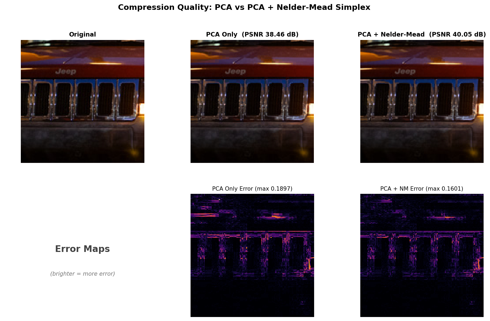
</p>

---

## Table of Contents

- [Quick Start](#quick-start)
- [What is Block Compression?](#what-is-block-compression)
  - [Why Block Compression Exists](#why-block-compression-exists)
  - [The Core Idea](#the-core-idea-two-colors-and-a-recipe)
  - [Geometric Insight](#geometric-insight-a-line-in-color-space)
- [How tinyBC Works](#how-tinybc-works)
  - [Step 1: PCA Initial Guess](#step-1-pca-initial-guess)
  - [Step 2: Nelder-Mead Refinement](#step-2-nelder-mead-refinement)
  - [The Pipeline](#the-full-pipeline)
- [tinyMLP: Neural Image Compression](#tinymlp-neural-image-compression)
  - [The Idea](#the-idea)
  - [Architecture: Hash Encoding + SIREN](#architecture-hash-encoding--siren)
  - [Latent Texture: a Different Compression Primitive](#latent-texture-a-different-compression-primitive)
  - [Interactive Demo](#interactive-demo)
- [Results](#results)
- [Code Walkthrough](#code-walkthrough)
- [License](#license)

---

## Quick Start

### tinyBC — Block Compression

**Prerequisites:** Python 3.10+, a GPU with Vulkan support, [SlangPy](https://shader-slang.com/slang-python/).

```bash
pip install slangpy sgl numpy
```

```bash
python tinybc.py                          # compress sample.jpg, print PSNR
python tinybc.py -i photo.png -o out.png  # custom input, save decoded output
python tinybc.py -b                       # benchmark mode (1000 iterations)
```

### tinyMLP — Neural Compression (Hash Encoding)

**Prerequisites:** Python 3.10+, PyTorch, OpenCV (optional, for interactive window).

```bash
pip install torch opencv-python
```

```bash
python tinyMLP.py                                    # train on sample.png, watch it learn
python tinyMLP.py -i photo.png                       # custom input
python tinyMLP.py --log2_T 10 --hidden 32 --depth 1  # tiny model, ~16x compression
python tinyMLP.py --save model.pth                   # save trained weights
```

**Controls:** `Q`/`ESC` quit, `Space` pause/resume, `S` save snapshot.

### tinyLatent — Neural Compression (Latent Texture)

```bash
python tinyLatent.py                                          # single-scale (default)
python tinyLatent.py --ch_lo 16 --ch_hi 2                    # two-scale (~104K params)
python tinyLatent.py --ch_lo 16 --ch_hi 2 --qat_bits 8       # two-scale + QAT int8
python tinyLatent.py --activation gelu                        # experiment: GELU decoder
python tinyLatent.py --vis_latent                             # show latent in 3rd panel
python tinyLatent.py --ch_lo 16 --ch_hi 2 --qat_bits 8 \
    --save_latent latent.npz                                  # save uint8 artifact
```

---

## What is Block Compression?

### Why Block Compression Exists

When a GPU renders a 3D scene, it reads texture data _millions_ of times per frame. Unlike JPEG or PNG, the GPU can't afford to decompress an entire image first — it needs **random access** to any pixel at any time.

This rules out most image compression formats. JPEG uses variable-length coding that requires sequential decoding. PNG uses an LZ-based stream. Neither lets you jump to pixel (423, 871) without decoding everything before it.

**Block compression** solves this by dividing the image into small, independent tiles — typically **4×4 pixels** — each compressed to a **fixed-size** bit string (128 bits for BC7). The GPU can decode any block in O(1) without touching any other block.

| Property | JPEG/PNG | Block Compression |
|---|---|---|
| Random access | No | **Yes** |
| Decode unit | Entire image | Single 4×4 block |
| GPU-friendly | No (CPU decode) | **Yes** (hardware decoder) |
| Compression ratio | Very high | Moderate (~4:1) |
| Use case | Storage, web | **Real-time rendering** |

### The Core Idea: Two Colors and a Recipe

Every 4×4 block is encoded as:

1. **Two endpoint colors** (Color A and Color B)
2. **16 weights** — one per pixel, each saying "how much of A vs B"

To decode a pixel, just interpolate: `pixel = lerp(A, B, weight)`.

<p align="center">
  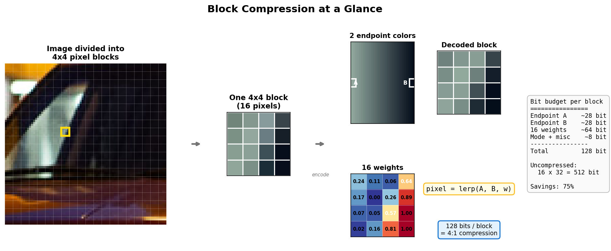
</p>

The total cost: ~28 bits for each endpoint + ~64 bits for 16 weights + a few mode bits = **128 bits per block**, or **0.5 bytes per pixel**. Uncompressed RGBA would cost 16 × 32 = 512 bits — a 4× saving.

> **Key insight:** We're betting that within any tiny 4×4 region of an image, all the colors can be _reasonably approximated_ as a blend of just two colors. For natural images, this bet pays off surprisingly well.

### Geometric Insight: A Line in Color Space

Here's another way to think about it. Each pixel is a point in RGB color space (a 3D cube). Block compression finds the **best-fit line** through these 16 points, then projects each pixel onto that line.

<p align="center">
  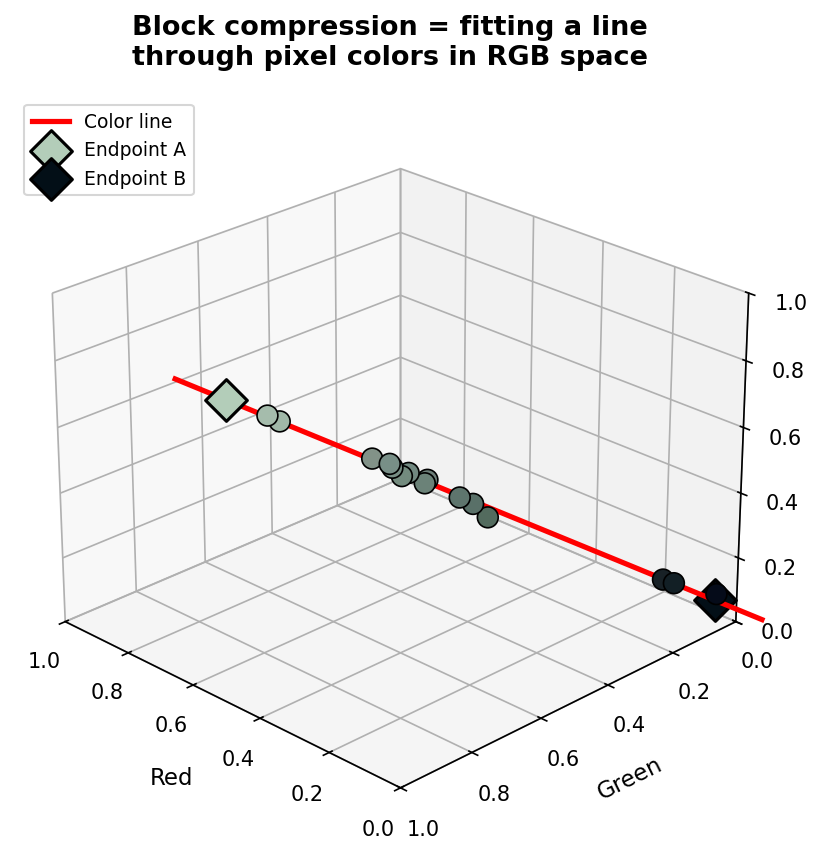
</p>

The two endpoints define where the line starts and ends. The per-pixel weight records where each pixel falls along this line. All the compression error comes from the **perpendicular distance** between each pixel and the line — the off-axis detail that gets lost.

---

## How tinyBC Works

### Step 1: PCA Initial Guess

Finding the "best" two endpoints is an optimization problem. A brute-force search over all possible RGBA endpoint pairs would be astronomically expensive (each endpoint lives in a continuous 4D space).

tinyBC starts with a fast, classic trick: **Principal Component Analysis (PCA)**.

1. Compute the **mean color** of the 16 pixels.
2. Find the **dominant direction** of color variation (the axis of greatest spread).
3. Project all pixels onto this axis.
4. The two extremes become the initial endpoint colors.

This is cheap — just a few dot products — and gives a surprisingly good initial answer. For many blocks, it's already good enough (loss below a threshold), and we skip straight to output.

### Step 2: Nelder-Mead Refinement

For harder blocks (strong color variation, edges, mixed content), the PCA solution can be noticeably off. tinyBC then applies **Nelder-Mead simplex optimization** to refine the endpoints.

<p align="center">
  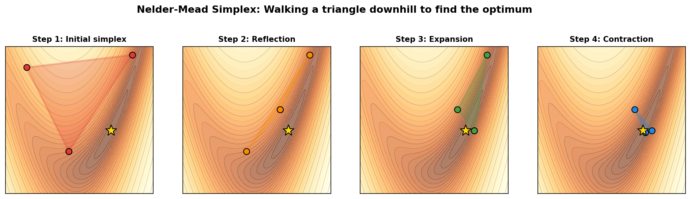
</p>

Nelder-Mead is a derivative-free optimizer. It works by maintaining a **simplex** (a geometric shape with N+1 vertices in N dimensions). Since our search space is 8-dimensional (4 components × 2 endpoints), the simplex has 9 vertices. At each iteration, it:

| Operation | What happens |
|---|---|
| **Reflection** | Mirror the worst vertex through the centroid of the rest — try the "opposite direction" |
| **Expansion** | If reflection found a great point, push even further in that direction |
| **Contraction** | If reflection didn't help, pull the worst vertex closer to the centroid |
| **Shrink** | If nothing works, shrink the entire simplex toward the best vertex |

After up to 64 iterations, the simplex converges to a local (often global) minimum. The best vertex gives our refined endpoints.

> **Why Nelder-Mead?** It's derivative-free (our loss landscape is non-smooth due to weight quantization), simple to implement in a shader, and converges quickly in low dimensions. Perfect for a GPU compute kernel where each thread independently optimizes one 4×4 block.

### The Full Pipeline

<p align="center">
  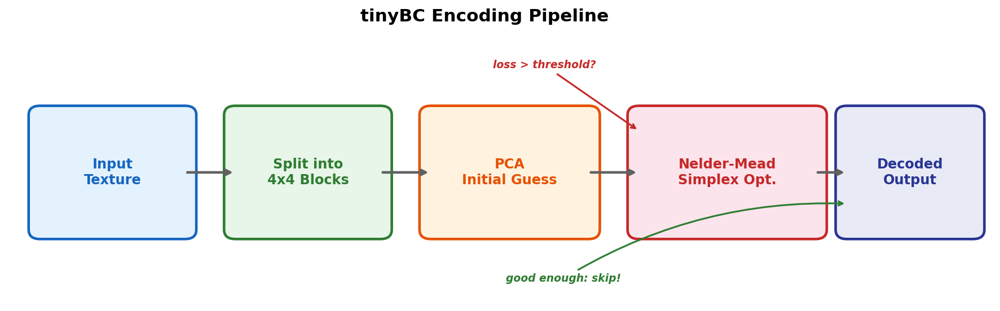
</p>

1. **Load** the input texture onto the GPU.
2. **Dispatch** one compute thread per 4×4 block.
3. Each thread runs **PCA** to get initial endpoints.
4. If loss > threshold (0.004), run **Nelder-Mead** (64 iterations max).
5. Compute final per-pixel weights and write the decoded block to the output texture.
6. **Compute PSNR** on the CPU by comparing input vs decoded.

---

## tinyMLP: Neural Image Compression

### The Idea

What if, instead of hand-crafted block partitions, we let a **neural network** learn to compress the image?

tinyMLP takes a radically different approach: train a small MLP (multi-layer perceptron) to map pixel coordinates to colors:

```
input: (x, y)  →  MLP  →  output: (r, g, b)
```

The "compressed file" is just the **network weights**. A 101K-parameter network weighs ~400KB — for a 512×512 image (768KB) that's **2× compression** achieving ~39 dB PSNR with no block artifacts.

| What's stored | Block compression (tinyBC) | Neural compression (tinyMLP) |
|---|---|---|
| Per-block data | 2 endpoints + 16 weights | — |
| Global model | — | MLP weights (~152KB) |
| Decoding | `lerp(A, B, w)` per pixel | Forward pass through network |
| Artifacts | Block boundaries | Smooth, frequency-dependent blur |
| Compression ratio | Fixed 4:1 | Tunable via model size |

### Architecture: Hash Encoding + SIREN

<p align="center">
  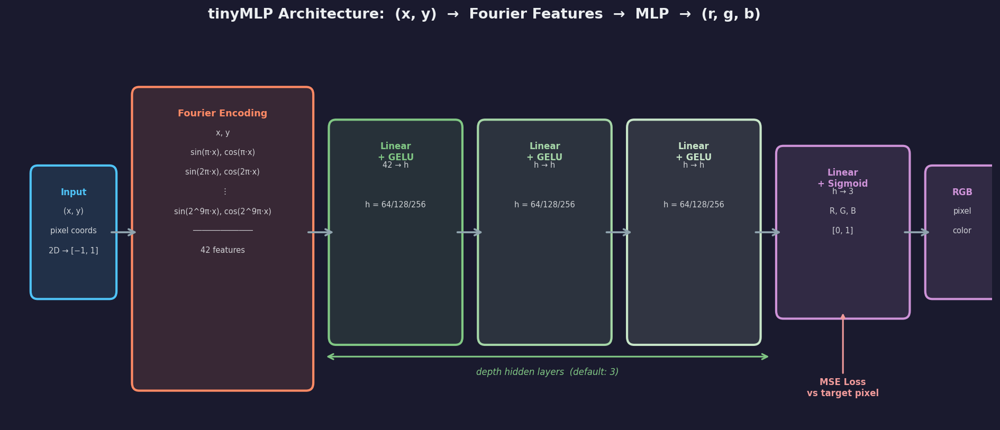
</p>

tinyMLP uses two modern components that, combined, dramatically outperform the naive Fourier+GELU approach:

**Multi-resolution Hash Encoding** (Müller et al. 2022, Instant-NGP):  
For each coordinate `(x, y)`, we query L=16 spatial grids at geometrically spaced resolutions (coarse 16px → fine 512px). At each level, the 4 surrounding grid corners are looked up in a small learnable hash table and bilinearly interpolated. The 16 interpolated feature vectors are concatenated into a 32-dim descriptor. This is fast, differentiable, and inherently multi-scale — coarse levels capture global structure, fine levels capture detail.

```
(x, y) → [query 16 grids] → [hash lookup + bilinear interp] → 32-dim features
```

**SIREN decoder** (Sitzmann et al. 2020):  
The 32 hash features are decoded by 2 hidden layers using `sin(ω₀ · Wx + b)` activations rather than ReLU/GELU. Sinusoidal activations are theoretically well-suited for representing continuous signals and their derivatives — they avoid the spectral bias that makes ReLU networks converge slowly on high-frequency content.

```
32 features → [sin(ω₀·Wx)] × depth → Linear → Sigmoid → (r, g, b)
```

**Two separate learning rates** ensure stable training: the hash tables update fast (`lr=3e-2`), the SIREN decoder updates slowly (`lr=1e-3`).

### Latent Texture: a Different Compression Primitive

`tinyLatent.py` swaps the **sparse hash tables** for a **dense 2D feature grid** — the _latent texture_ — while keeping the SIREN decoder identical.  This makes the comparison orthogonal: only the encoder changes.

```
HashEncoding  →  32 features  ─┐
                                ├─ same SIREN decoder ─ (r, g, b)
LatentTexture →  32 features  ─┘
```

**How the latent texture works:**  
A learnable parameter tensor of shape `C × (H/scale) × (W/scale)` (e.g. `32 × 64 × 64` for a 512×512 image with `--scale 8`) is sampled at the query coordinate using `F.grid_sample` (bilinear, border padding).  The downscaled grid acts as a compressible intermediate representation:

- **Spatial coherence** is enforced by construction — nearby pixels read similar features.
- **The grid can be saved as float16 `.npy`** and further compressed with standard image codecs (JPEG, PNG), enabling true two-stage compression.
- **No hash collisions** — every feature occupies an explicit spatial slot. This trades capacity for interpretability: you can literally visualise what the network remembers.

#### Two-Scale Latent

The single-scale latent's weakness — no multi-resolution structure — can be addressed by adding a second, finer grid, directly mirroring [RTXNTC](https://github.com/NVIDIA-RTX/RTXNTC)'s dual-resolution latent shape:

```
Lo grid  (ch_lo channels, scale_lo=8 → 64×64)   — global structure
Hi grid  (ch_hi channels, scale_hi=4 → 128×128)  — fine detail
         ↓ concat → 32-dim total → SIREN decoder (unchanged)
```

```bash
python tinyLatent.py --ch_lo 16 --ch_hi 2   # two-scale, ~104K params
```

#### Quantization-Aware Training (QAT)

With `--qat_bits 8`, the latent values are **fake-quantised** during training using a Straight-Through Estimator (STE): the decoder learns to tolerate discrete integer values, so at save time the latent is stored as real `uint8`. This is exactly what JPEG and PNG expect — making the two-stage compression path far more efficient.

```bash
python tinyLatent.py --ch_lo 16 --ch_hi 2 --qat_bits 8   # QAT int8
python tinyLatent.py --ch_lo 16 --ch_hi 2 --qat_bits 8 --save_latent latent.npz
# latent.npz contains per-channel uint8 data + float32 min/max metadata
```

The STE trick: in the forward pass, values are rounded to 256 levels per channel. In the backward pass, gradients flow through the rounding as if it were identity — so standard Adam can still train through the quantisation.

<p align="center">
  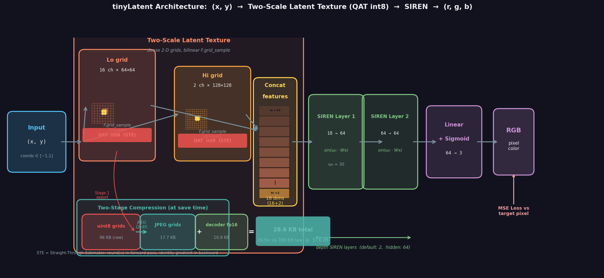
</p>

#### Orthogonal Comparison

All four variants use the same `hidden=64, depth=2` SIREN decoder, trained for the same steps on lossless `sample.png`:

| Encoder | Params | Storage (stage-1) | @500 steps | @2000 steps | @5000 steps |
|---|---|---|---|---|---|
| Hash Default (`log2_T=12`) | 101,399 | 397 KB fp32 (1.9×) | 34.9 dB | 37.9 dB | **39.5 dB** |
| Latent Single-scale (`ch=32, scale=8`) | 137,539 | 550 KB fp32 (1.4×) | 30.4 dB | 35.3 dB | 37.5 dB |
| Latent Two-scale (`ch_lo=16/s8 + ch_hi=2/s4`) | 103,875 | 185 KB fp16 (4.2×) | 32.0 dB | 35.9 dB | 37.7 dB |
| **Two-scale + QAT int8** | 103,875 | **28.6 KB** (7.2× → **26.9×** w/ JPEG) | 32.0 dB | 36.0 dB | **37.6 dB** |

**Key observations:**
- Hash encoding still converges fastest owing to its 16-level multi-scale design.
- Two-scale latent outperforms single-scale by +0.2 dB at 5000 steps while using **25% fewer parameters** (104K vs 138K) — multi-resolution structure helps even with just two levels.
- **QAT int8** costs only ~0.2 dB vs non-quantised but unlocks a two-stage path: uint8 grids compress to 17.7 KB under JPEG, and together with the 10.9 KB fp16 decoder the total artifact is **28.6 KB — 26.9× smaller** than the 768 KB raw image.
- The latent grid's unique advantage remains: it is a **concrete, spatial artifact** — visualisable, quantisable, and compressible with standard image codecs.

#### Decoder Activation: SIREN vs GELU vs SiLU

Although bilinear `F.grid_sample` produces spatially smooth feature vectors, swapping SIREN for GELU or SiLU costs **~5 dB** at the same budget. Sinusoidal activations provide a far richer non-linear basis for the 18D→RGB mapping than piecewise-smooth activations can with only 2 layers and 64 hidden units. Use `--activation gelu` for experiments where training stability matters more than peak quality.

| Decoder | @500 steps | @2000 steps | @5000 steps |
|---|---|---|---|
| SIREN (default) | 32.0 dB | 36.1 dB | **38.0 dB** |
| GELU MLP | 28.5 dB | 31.3 dB | 32.8 dB |
| SiLU MLP | 28.0 dB | 31.0 dB | 32.1 dB |

*(Two-scale latent, `ch_lo=16 + ch_hi=2`, `hidden=64 depth=2`, 5000 steps)*

<p align="center">
  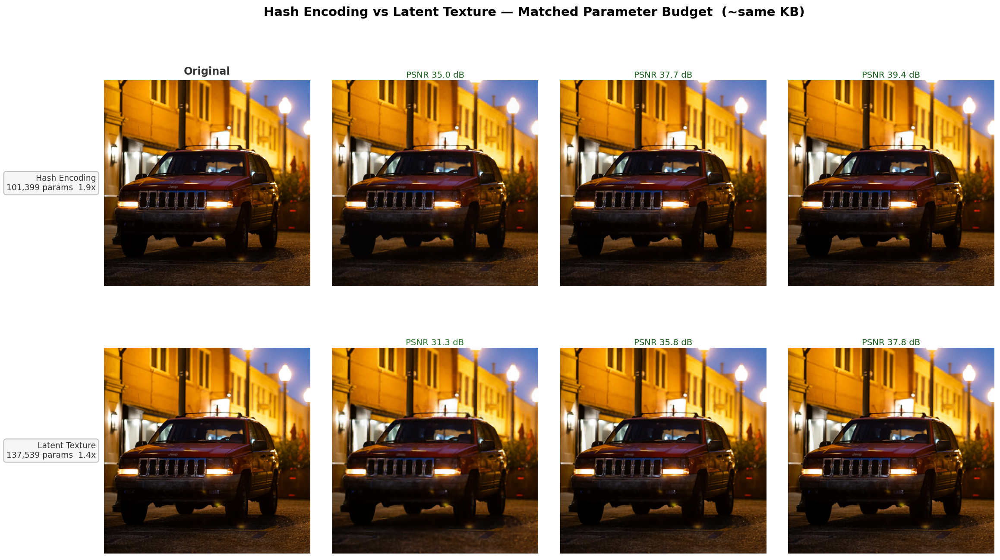
</p>

<p align="center">
  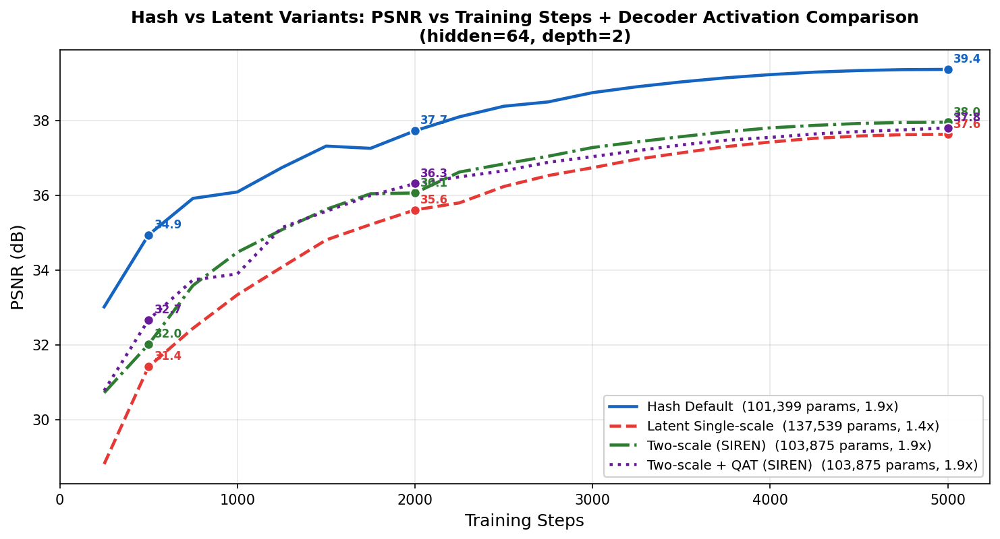
</p>

#### Inside the Latent Grid

The figure below shows (left to right): the original image crop, the first three latent channels rendered as RGB, the final reconstruction, and the per-pixel error heatmap.

<p align="center">
  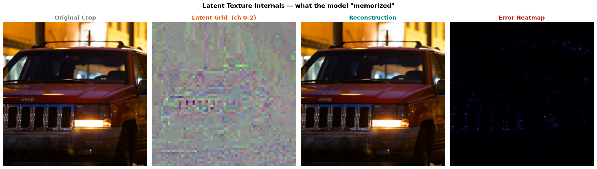
</p>

The latent channel preview shows a blurry, compressed-looking version of the scene — the network has "pre-decoded" the image into a coarse feature map, leaving the SIREN decoder to hallucinate fine-grained texture from position alone.

#### Two-Stage Compression Potential

Because the latent grid is a regular array, it can be compressed a second time with standard image codecs:

```bash
# fp16 path (no QAT) — save as float16 .npy
python tinyLatent.py --save_latent latent.npy
# Latent fp16 (.npy): ~256 KB for 32×64×64; further JPEG: ~30–50 KB savings

# uint8 path (QAT) — save as per-channel uint8 .npz  ← much more compressible
python tinyLatent.py --ch_lo 16 --ch_hi 2 --qat_bits 8 --save_latent latent.npz
# latent.npz: ~100 KB; JPEG of uint8 latent: typically 3–5× smaller than fp16
```

For the default two-scale + QAT int8 configuration on a 512×512 image (768 KB uncompressed), the breakdown is:

| Component | Raw size | After JPEG Q=85 |
|---|---|---|
| Lo grid uint8 (16×64×64) | 64.0 KB | **12.2 KB** (5.2×) |
| Hi grid uint8 (2×128×128) | 32.0 KB | **5.5 KB** (5.9×) |
| Decoder fp16 | 10.9 KB | 10.9 KB (no codec needed) |
| **Total** | 96 KB (7.2× stage-1) | **28.6 KB (26.9× stage-2)** |

The uint8 latent grids are spatially smooth (bilinear sampling enforces spatial coherence), so JPEG achieves 5–6× compression on them — far better than on random float data. This is the same two-stage architecture used by [RTXNTC](https://github.com/NVIDIA-RTX/RTXNTC) in production.

### Interactive Demo

Run `python tinyMLP.py` to watch the network learn an image in real-time:

1. The window shows **Original** (left) and **MLP Reconstruction** (right) side by side.
2. Within the first seconds, a clean low-frequency image appears — hash tables learn the broad structure fast.
3. Within 1–2 minutes, fine-grained texture and edges snap into focus.
4. The status bar tracks step, loss, PSNR, compression ratio, and elapsed time live.

<p align="center">
  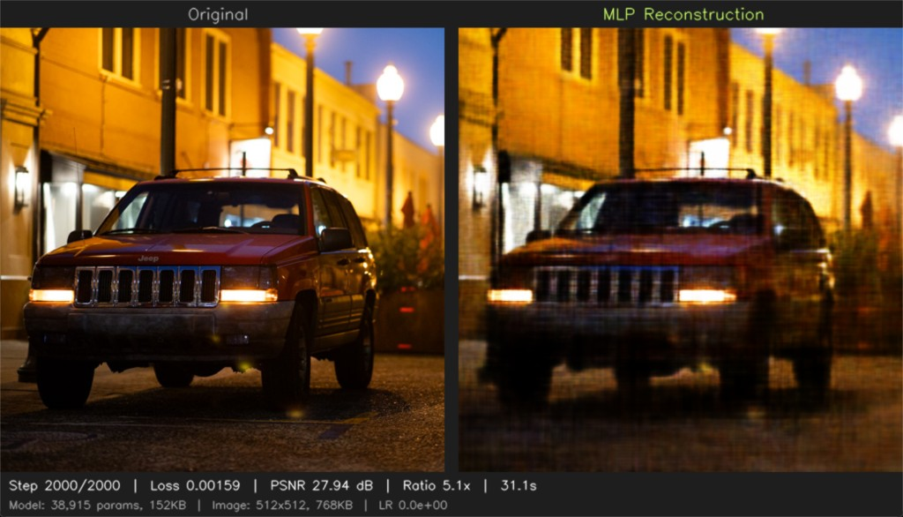
</p>

### Quality vs Steps vs Model Size

The table below shows measured PSNR for three architectures at three checkpoints on the 512×512 test image:

| Architecture | Params | Size | Compression | 500 steps | 2000 steps | 5000 steps |
|---|---|---|---|---|---|---|
| Tiny `--log2_T 10 --hidden 32 --depth 1` | 12,317 | 48 KB | **16x** | 25.6 dB | 27.0 dB | 27.5 dB |
| Default `--log2_T 12 --hidden 64 --depth 2` | 101,399 | 397 KB | **1.9x** | 34.8 dB | 37.9 dB | **39.4 dB** |
| Large `--log2_T 14 --hidden 128 --depth 3` | 322,145 | 1.26 MB | 0.6x | 39.4 dB | 43.4 dB | **46.0 dB** |

Compare to the old Fourier+GELU baseline: Default config went from 27.9 dB → **39.4 dB** (+11.5 dB), and Tiny from 24.3 dB → **27.5 dB** (+3.2 dB).

<p align="center">
  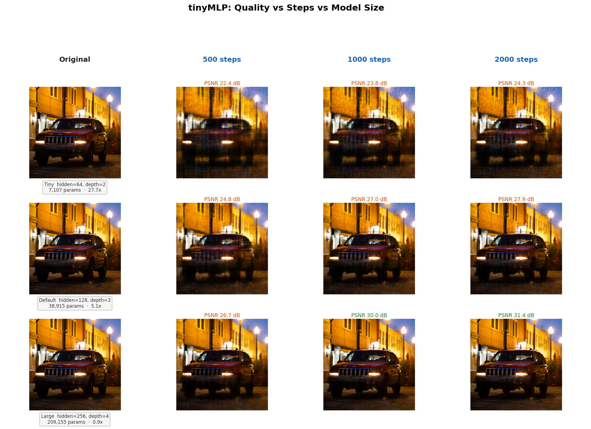
</p>

<p align="center">
  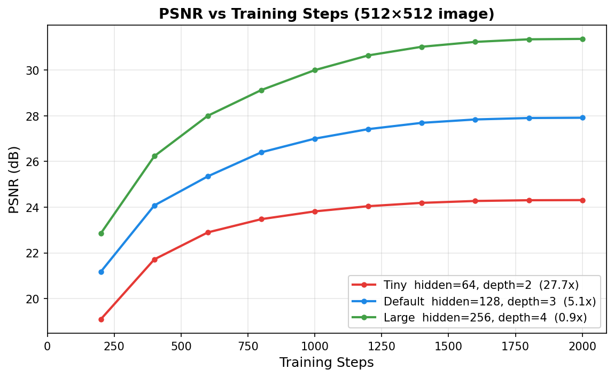
</p>

The hash encoding enables rapid early convergence — the Default config already hits 34.8 dB at step 500. The PSNR curves still haven't fully flattened at 5000 steps, so more training continues to help.

---

## Results

### tinyBC — Block Compression

| Metric | PCA Only | PCA + Nelder-Mead |
|---|---|---|
| **PSNR** | 38.46 dB | **40.05 dB** |
| Max per-pixel error | 0.1897 | **0.1601** |

The Nelder-Mead refinement adds ~1.6 dB PSNR — a meaningful improvement, especially on blocks with complex color distributions (edges, specular highlights, mixed materials).

<p align="center">
  
</p>

The error maps (bottom row) use the `inferno` colormap — brighter means more error. Notice how the Nelder-Mead version has fewer bright spots, especially around the grille bars and headlight edges where color variation is highest.

### tinyMLP — Neural Compression (Hash Encoding + SIREN)

| Model | Params | Size | Compression | PSNR @ 5000 steps |
|---|---|---|---|---|
| Large `--log2_T 14 --hidden 128 --depth 3` | 322K | 1.26 MB | 0.6x | **46.0 dB** |
| Default `--log2_T 12 --hidden 64 --depth 2` | 101K | 397 KB | 1.9x | **39.4 dB** |
| Tiny `--log2_T 10 --hidden 32 --depth 1` | 12K | 48 KB | 16x | **27.5 dB** |

Switching from Fourier+GELU to Hash Encoding+SIREN boosted Default config by **+11.5 dB PSNR**. Neural compression still trades decoding throughput for smooth, artifact-free quality — but at these PSNR levels the reconstructions are visually nearly indistinguishable from the original.

### tinyLatent — Neural Compression (Latent Texture + SIREN)

Same SIREN decoder as tinyMLP (identical `hidden=64, depth=2`). Only the encoder changes — sparse hash tables → dense bilinear-sampled grid.

| Encoder | Params | Compression | 500 steps | 2000 steps | 5000 steps |
|---|---|---|---|---|---|
| Hash Default (`log2_T=12`) | 101,399 | 1.9× (stage-1) | 34.9 dB | 37.9 dB | **39.5 dB** |
| Latent Single-scale (`ch=32, scale=8`) | 137,539 | 1.4× (stage-1) | 30.4 dB | 35.3 dB | 37.5 dB |
| Latent Two-scale (`ch_lo=16/s8 + ch_hi=2/s4`) | 103,875 | 4.2× (stage-1) | 32.0 dB | 35.9 dB | **37.7 dB** |
| Two-scale + QAT int8 (`--qat_bits 8`) | 103,875 | **7.2×** stage-1 / **26.9×** stage-2 | 32.0 dB | 36.0 dB | **37.6 dB** |

Two-scale latent matches Hash Default's parameter budget and narrows the PSNR gap vs single-scale while using fewer parameters. QAT int8 adds negligible quality cost (−0.2 dB) but unlocks a powerful two-stage compression path: the uint8 grids JPEG-compress to 28.6 KB total — a **26.9×** compression ratio on a 512×512 image at 37.6 dB. See the two-stage compression section above for the full breakdown.

---

## Code Walkthrough

### `tinybc.slang` — The GPU Block Compressor (~379 lines)

| Section | Lines | What it does |
|---|---|---|
| `compute_unorm_end_point_and_unorm_weight` | 53–149 | PCA-based initial endpoint + weight estimation |
| `compute_weights` | 152–172 | Given endpoints, project all 16 pixels onto the endpoint line to get weights |
| `compute_loss` | 175–188 | MSE between original pixels and their endpoint-interpolated reconstructions |
| `sort_simplex` | 191–206 | Bubble sort the 9 simplex vertices by loss (ascending) |
| `compute_centroid` | 209–217 | Mean of the 8 best vertices (excluding the worst) |
| `encoder` | 219–378 | Main entry point: load block → PCA → (optional) Nelder-Mead → write output |

### `tinybc.py` — The BC7 Python Driver (~72 lines)

Loads the input texture via `sgl.TextureLoader`, creates an output texture, dispatches the `encoder` kernel over all 4×4 tiles, and computes PSNR.

### `tinyMLP.py` — Hash Encoding Neural Compressor (~280 lines)

| Class / function | What it does |
|---|---|
| `HashEncoding` | Multi-resolution hash tables; bilinear interp + spatial hash lookup at 16 resolutions |
| `SirenLayer` | `sin(ω₀ · Wx + b)` with SIREN weight initialization for stable deep networks |
| `ImageMLP` | Combines `HashEncoding` → `SirenLayer` stack → `Linear + Sigmoid` head |
| `render_full` | Chunked full-image forward pass (avoids OOM on large images) |
| `main` | Arg parsing, dual-LR Adam optimizer, cosine LR schedule, OpenCV/mpl display loop |

### `tinyLatent.py` — Latent Texture Neural Compressor (~350 lines)

| Class / function | What it does |
|---|---|
| `quantize_ste_perchannel` | Per-channel fake quantisation with Straight-Through Estimator; enables QAT training |
| `save_latent_uint8` | Saves a float32 latent as per-channel uint8 `.npz` (actual compressed artifact for QAT mode) |
| `LatentTexture` | Two-scale dense grids (`lo` + optional `hi`); bilinear `F.grid_sample`; QAT applied in `forward` via `set_step` |
| `LatentImageMLP` | Combines `LatentTexture` → `SirenLayer` stack → `Linear + Sigmoid` (identical decoder to tinyMLP) |
| `estimate_jpeg_size` / `estimate_jpeg_size_uint8` | Estimate JPEG-compressed latent size for two-stage compression potential reporting |
| `main` | Single-LR Adam, cosine schedule, `--vis_latent` 3rd panel, `--save_latent` fp16/uint8 export |

### `generate_mlp_figures.py` — Figure Generator

| Function | Output |
|---|---|
| `fig_mlp_architecture` | `images/fig_mlp_architecture.png` — Hash Encoding + SIREN architecture diagram |
| `train_snapshots` | Headless Hash model training; returns PSNR snapshots + curve |
| `fig_mlp_comparison` | `images/fig_mlp_comparison.png` + `fig_mlp_psnr_curve.png` — Hash model grid |
| `train_latent_snapshots` | Headless Latent model training; returns PSNR snapshots + curve |
| `fig_latent_vs_hash` | `images/fig_latent_vs_hash_grid.png` + `fig_latent_vs_hash_curves.png` — orthogonal comparison |
| `fig_latent_visualization` | `images/fig_latent_visualization.png` — 4-panel latent internals figure |

```
tinyASTC/
├── tinybc.slang             # GPU compute shader (block compressor)
├── tinybc.py                # BC7 driver script
├── tinyMLP.py               # Neural compression — Hash Encoding + SIREN
├── tinyLatent.py            # Neural compression — Latent Texture + SIREN
├── sample.png               # Test input image (lossless)
├── generate_figures.py      # Generate tinyBC educational figures
├── generate_mlp_figures.py  # Generate all MLP comparison figures
├── images/                  # All generated figures
└── LICENSE                  # MIT
```

---

## License

MIT License. See [LICENSE](LICENSE) for details.
